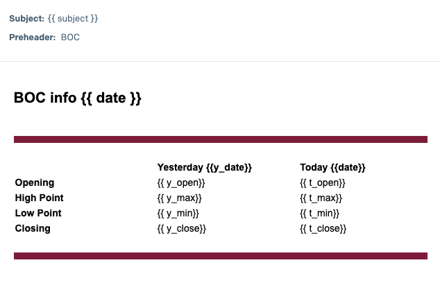

# ExchangeTracer

A simple script for bank BOC tracing currency. The script uses [`bocfx`](https://github.com/bobleer/bocfx) API to download daily foreign exchange rates from Bank of China (BOC) and aggregates the data in a daily manner and saves them to a text file with the following columns:
- date
- opening price
- high point
- low point
- closing price

For example:
```
2018/01/01 79.69 79.69 79.69 79.69
2018/01/02 79.69 80.2 79.64 79.67
2018/01/03 79.67 79.98 79.67 79.82
2018/01/04 79.82 80.24 79.79 80.17
```

## To start:
- Config file `bocfx.config`, with template format:
    ```
    OUTPUT=output/bocfx_output.txt
    CURRENCY=SEK
    START=AUTO
    END=TODAY
    BUCKET=gs://<bucket>
    ```
    Mandatory fields include:
    - URL : address to the search page
    - CURRENCY: 1320 is SEK
    - START: ACCEPT 'YESTERDAY' or Date format 'YYYY-MM-DD'
    - END: ACCEPT 'TODAY' or Date format 'YYYY-MM-DD'

    Optional fields include:
    - BUCKET: Google Cloud Storage bucket url with gs://xxx. Leave empty if upload file is not needed
- Set up `.env` file if need to send the data to your email. Email is sent via using SendGrid. `.env` should include:
    ```
    SENDGRID_API_KEY=xxxxxx
    EMAIL_FROM=xxx@xxx.xxx
    EMAILS_TO=xxx@xxx.xxx,xxx@xxx.xxx
    TEMPLATE_ID=<SendGrid Template ID. Optional. Will send plain text if not set>
    ```
    Currently what template fields are accepted are hard coded:
    ```
    {
        "subject": <>,
        "date": <today's date>,
        "y_date": <yesterday's date>,
        "y_open": <yesterday's opening>,
        "y_max": <yesterday's high point>,
        "y_min": <yesterday's low point>,
        "y_close": <yesterday's closing>,
        "t_open": <today's opening>,
        "t_max": <today's high point>,
        "t_min": <today's low point>,
        "t_close": <today's closing>
    }
    ```
    Preview:
    

## To run:
### Docker
```
docker compose -f "docker-compose.yaml" up -d --build
```

### Local
```
pip install requirements.txt
export SENDGRID_API_KEY=<xxx>
export EMAIL_FROM=<xxx>
export EMAILS_TO=<xxx>
export TEMPLATE_ID=<xxxx>

python boc_api.py
```